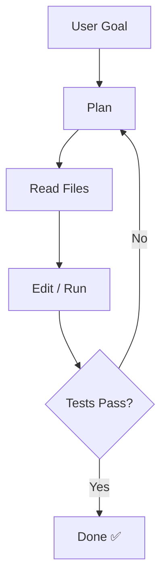

<h1 flex="~ col" class="text-center">

  What are
   Agentic

Coding Tools?

</h1>

---
layout: default
transition: slide-up
---

# What are Terminal Agentic Tools?

AI assistants that **live in your terminal** — they don't just suggest code, they *act*.

  
🤔

  
Traditional AI

  
You copy-paste suggestions from a chat UI into your editor

  
⚡

  
Agentic Tools

  
The AI reads your files, writes code, runs tests — autonomously

  
🔁

  
The Loop

  
Plan → Act → Observe → Repeat until the task is done

> **You describe the goal. The agent figures out the steps.**

<!--
The key shift: from autocomplete to autonomous execution.
These tools can read your entire codebase, understand context,
and make coordinated changes across many files.
-->

---
layout: two-cols
transition: slide-up
---

# The Agent Loop

How agentic tools reason and act:

  
1. Plan

  
Break the goal into steps, understand the codebase structure

  
2. Read

  
Explore relevant files, search for patterns, understand context

  
3. Act

  
Edit files, run shell commands, install packages

  
4. Verify

  
Run tests, check types, lint — confirm the change works

  
5. Repeat

  
Loop until the task is complete or clarification is needed

::right::

<!--
The agentic loop is the key mental model.
Unlike autocomplete, the agent owns the full cycle from reading to verification.
-->
